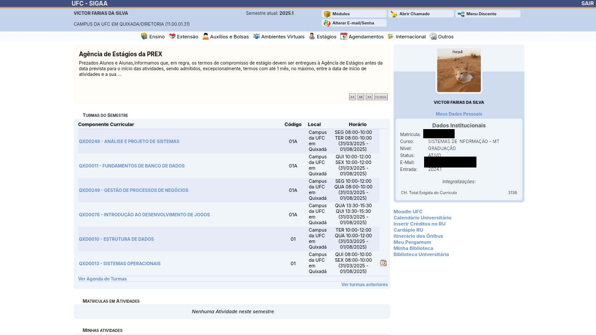

 

Uma extensão para navegadores Chromium e Firefox que adiciona temas e melhora a interface do SIGAA, proporcionando uma experiência visual mais agradável e funcional.

## Imagens

## TODO

- **Trocar janela de login**
- **Tema Escuro**
- **Temas customizáveis**
- **Compatibilidade com Mobile**

## Funcionalidades

- **Melhorias na interface:** Ajustes na usabilidade e design para facilitar o uso do sistema.
- **Lembrar senha:** Permite que o usuário salve suas credenciais de login de forma segura.
- **Links úteis:** Adiciona links rápidos para acessar Créditos do RU, Moodle, Intinerário do Ônibus, Pergamum.
- **Compatibilidade:** Suporte para navegadores Chromium (como Google Chrome e Microsoft Edge) e Firefox.

## Instalação

Para instalar a extensão, visite o site oficial: [SIGAA Themes](https://sigatemas.netlify.app/)

No site, você encontrará as instruções detalhadas para instalar e começar a usar a extensão no seu navegador preferido.

# Apoie o Projeto

Se você acha que este projeto foi útil e gostaria de apoiar o desenvolvimento contínuo, considere fazer uma doação. Sua contribuição ajuda a manter o projeto ativo e melhorar ainda mais! :D

**Um crédito do RU:** 
**Uma coxinha da tia:** 
**Um salgado:** 

**Outros valores (chave PIX aleatório):**

[qrcode]

## Links Úteis

- [Site oficial](https://sigatemas.netlify.app/)

---
**Nota:** Este projeto é independente e não possui relação oficial com o SIGAA ou suas instituições mantenedoras.